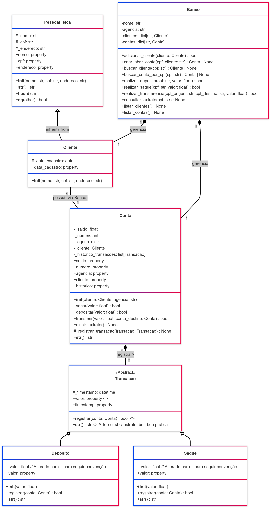

# Sistema Bancário Simplificado (CLI) em Python - Introdução à POO

Este projeto foi desenvolvido como material didático para uma aula introdutória de Programação Orientada a Objetos (POO) em Python, no contexto de um curso de Ciências da Computação. O objetivo é demonstrar conceitos fundamentais de POO de forma incremental, utilizando a simulação de um sistema bancário básico com interação via linha de comando (CLI).

## Descrição

O sistema simula operações bancárias essenciais, como criação de clientes e contas, depósitos, saques, transferências e consulta de extratos. Ele é estruturado utilizando classes para representar as entidades principais:

* `PessoaFisica`: Classe base com informações de identificação pessoal.
* `Cliente`: Herda de `PessoaFisica`, representando um cliente do banco, com informações adicionais como data de cadastro.
* `Conta`: Representa a conta bancária, gerenciando saldo e histórico.
* `Transacao`: Classe abstrata para operações financeiras.
* `Deposito`, `Saque`: Classes concretas que herdam de `Transacao`.
* `Banco`: Classe central que gerencia clientes e contas, orquestrando as operações e servindo como ponto de interação principal.

O projeto enfatiza conceitos como:

* **Encapsulamento:** Agrupamento de dados (atributos) e comportamentos (métodos) dentro das classes.
* **Herança:** Reutilização de código (`Cliente` herdando de `PessoaFisica`, `Deposito`/`Saque` de `Transacao`).
* **Abstração:** Definição de interfaces (classe `Transacao` abstrata).
* **Polimorfismo:** Tratamento de objetos `Deposito` e `Saque` de forma uniforme como `Transacao` no histórico da conta.
* **Separação de Interesses (SoC):** Cada classe possui responsabilidades bem definidas.
* **Fonte Única de Verdade (SSOT):** O `Banco` centraliza o gerenciamento da relação cliente-conta.

## Funcionalidades da CLI

* `[nc]` **Novo Cliente:** Cadastra uma nova pessoa física como cliente do banco.
* `[ac]` **Abrir Conta:** Cria uma conta bancária para um cliente já existente (limitado a uma conta por cliente).
* `[lc]` **Listar Clientes:** Exibe a lista de clientes cadastrados no banco.
* `[la]` **Listar Contas:** Exibe a lista de contas abertas no banco com seus detalhes.
* `[d]` **Depositar:** Realiza um depósito em uma conta específica, identificada pelo CPF do titular.
* `[s]` **Sacar:** Realiza um saque de uma conta específica.
* `[t]` **Transferir:** Transfere um valor entre duas contas.
* `[e]` **Extrato:** Exibe o histórico de transações e o saldo atual de uma conta.
* `[q]` **Sair:** Encerra a execução do sistema.

## Tecnologias e Requisitos

* **Python 3.x** (testado com Python 3.11+)
* Módulos da biblioteca padrão do Python (`datetime`, `abc`, `textwrap`).
* **Não requer instalação de bibliotecas externas.**

## Como Executar

1. **Clone o repositório ou baixe o arquivo Python** (vamos assumir que o nome do arquivo principal é `banco_cli.py`).
2. **Certifique-se de ter o Python 3 instalado** em seu sistema.
3. **Abra um terminal ou prompt de comando.**
4. **Navegue até o diretório** onde você salvou o arquivo `banco_cli.py`.
5. **Execute o script** com o comando:

    ```bash
    python banco_cli.py
    ```

6. **Siga as instruções do menu** apresentado no terminal para interagir com o sistema bancário.

## Diagrama UML das Classes

O diagrama abaixo ilustra a estrutura das classes e seus relacionamentos neste projeto:



## Possíveis Melhorias Futuras

* **Persistência de Dados:** Salvar e carregar os dados de clientes e contas em arquivos (JSON, CSV) ou um banco de dados simples (SQLite) para que não se percam ao fechar o programa.
* **Tipos de Conta:** Implementar `ContaCorrente` e `ContaPoupanca` herdando de `Conta`, com regras específicas (limites, rendimento).
* **Transações Mais Complexas:** Adicionar outros tipos de transações (pagamento de boletos, empréstimos).
* **Tratamento de Erros:** Implementar exceções customizadas para erros específicos (ex: `SaldoInsuficienteError`, `ContaInexistenteError`).
* **Testes Unitários:** Adicionar testes para garantir o correto funcionamento das classes e métodos.
* **Refatoração:** Separar as classes em arquivos/módulos diferentes para melhor organização.